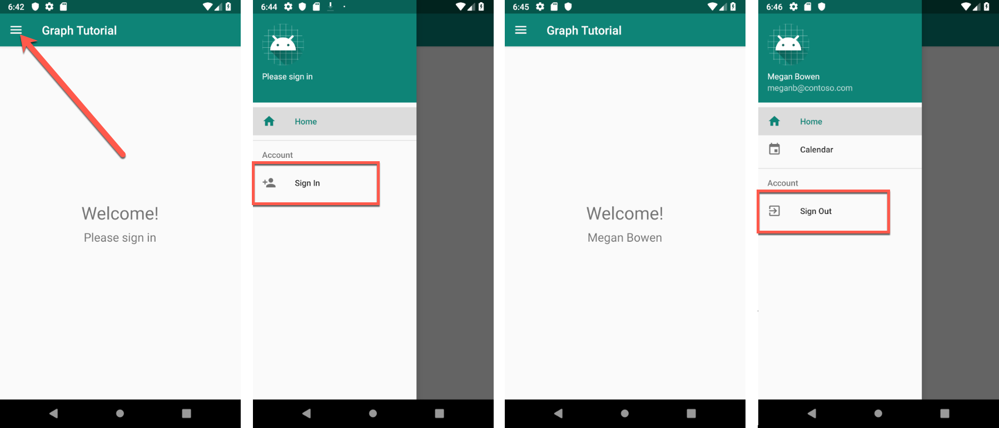

<!-- markdownlint-disable MD002 MD041 -->

<span data-ttu-id="22a73-101">最初に、新しい Android Studio プロジェクトを作成します。</span><span class="sxs-lookup"><span data-stu-id="22a73-101">Begin by creating a new Android Studio project.</span></span>

1. <span data-ttu-id="22a73-102">[Android Studio] を開き、[ようこそ] 画面で [**新しい Android studio プロジェクトの開始**] を選択します。</span><span class="sxs-lookup"><span data-stu-id="22a73-102">Open Android Studio, and select **Start a new Android Studio project** on the welcome screen.</span></span>

1. <span data-ttu-id="22a73-103">[**新しいプロジェクトの作成**] ダイアログで、[**空のアクティビティ**] を選択し、[**次へ**] を選択します。</span><span class="sxs-lookup"><span data-stu-id="22a73-103">In the **Create New Project** dialog, select **Empty Activity**, then select **Next**.</span></span>

    ![Android Studio の [新しいプロジェクトの作成] ダイアログのスクリーンショット](./images/choose-project.png)

1. <span data-ttu-id="22a73-105">[**プロジェクトの構成**] ダイアログで、[**名前**] `Graph Tutorial`をに設定し、[ **Language** ] `Java`フィールドがに設定されていることを`API 29: Android 10.0 (Q)`確認して、[**最小 API レベル**] がに設定されていることを確認します。</span><span class="sxs-lookup"><span data-stu-id="22a73-105">In the **Configure your project** dialog, set the **Name** to `Graph Tutorial`, ensure the **Language** field is set to `Java`, and ensure the **Minimum API level** is set to `API 29: Android 10.0 (Q)`.</span></span> <span data-ttu-id="22a73-106">必要に応じて、**パッケージ名**と**保存場所**を変更します。</span><span class="sxs-lookup"><span data-stu-id="22a73-106">Modify the **Package name** and **Save location** as needed.</span></span> <span data-ttu-id="22a73-107">**[完了]** を選択します。</span><span class="sxs-lookup"><span data-stu-id="22a73-107">Select **Finish**.</span></span>

    ![[プロジェクトの構成] ダイアログのスクリーンショット](./images/configure-project.png)

> [!IMPORTANT]
> <span data-ttu-id="22a73-109">このチュートリアルのコードと手順では、パッケージ名の**チュートリアル**を使用します。</span><span class="sxs-lookup"><span data-stu-id="22a73-109">The code and instructions in this tutorial use the package name **com.example.graphtutorial**.</span></span> <span data-ttu-id="22a73-110">プロジェクトを作成するときに別のパッケージ名を使用する場合は、この値が表示されているすべての場所にパッケージ名を使用してください。</span><span class="sxs-lookup"><span data-stu-id="22a73-110">If you use a different package name when creating the project, be sure to use your package name wherever you see this value.</span></span>

## <a name="install-dependencies"></a><span data-ttu-id="22a73-111">依存関係のインストール</span><span class="sxs-lookup"><span data-stu-id="22a73-111">Install dependencies</span></span>

<span data-ttu-id="22a73-112">に進む前に、後で使用する追加の依存関係をインストールします。</span><span class="sxs-lookup"><span data-stu-id="22a73-112">Before moving on, install some additional dependencies that you will use later.</span></span>

- <span data-ttu-id="22a73-113">`com.google.android.material:material`を選択すると、アプリで[ナビゲーションビュー](https://material.io/develop/android/components/navigation-view/)を使用できるようになります。</span><span class="sxs-lookup"><span data-stu-id="22a73-113">`com.google.android.material:material` to make the [navigation view](https://material.io/develop/android/components/navigation-view/) available to the app.</span></span>
- <span data-ttu-id="22a73-114">Azure AD 認証とトークン管理を処理するため[の、Android 用 Microsoft Authentication Library (MSAL)](https://github.com/AzureAD/microsoft-authentication-library-for-android) 。</span><span class="sxs-lookup"><span data-stu-id="22a73-114">[Microsoft Authentication Library (MSAL) for Android](https://github.com/AzureAD/microsoft-authentication-library-for-android) to handle Azure AD authentication and token management.</span></span>
- <span data-ttu-id="22a73-115">Microsoft graph [SDK For Java](https://github.com/microsoftgraph/msgraph-sdk-java)を使用して microsoft graph を呼び出すことができます。</span><span class="sxs-lookup"><span data-stu-id="22a73-115">[Microsoft Graph SDK for Java](https://github.com/microsoftgraph/msgraph-sdk-java) for making calls to the Microsoft Graph.</span></span>

1. <span data-ttu-id="22a73-116">[ **Gradle Scripts**] を展開し、 **Gradle (Module: app)** ファイルを開きます。</span><span class="sxs-lookup"><span data-stu-id="22a73-116">Expand **Gradle Scripts**, then open the **build.gradle (Module: app)** file.</span></span>

1. <span data-ttu-id="22a73-117">値の`dependencies`中に次の行を追加します。</span><span class="sxs-lookup"><span data-stu-id="22a73-117">Add the following lines inside the `dependencies` value.</span></span>

    ```Gradle
    implementation 'com.google.android.material:material:1.0.0'
    implementation 'com.microsoft.identity.client:msal:1.0.0'
    implementation 'com.microsoft.graph:microsoft-graph:1.6.0'
    ```

1. <span data-ttu-id="22a73-118">`packagingOptions` **Gradle (Module: app)** ファイル内の値の`android`中に値を追加します。</span><span class="sxs-lookup"><span data-stu-id="22a73-118">Add a `packagingOptions` value inside the `android` value in the **build.gradle (Module: app)** file.</span></span>

    ```Gradle
    packagingOptions {
        pickFirst 'META-INF/jersey-module-version'
    }
    ```

1. <span data-ttu-id="22a73-119">変更内容を保存します。</span><span class="sxs-lookup"><span data-stu-id="22a73-119">Save your changes.</span></span> <span data-ttu-id="22a73-120">[**ファイル**] メニューの [**プロジェクトを Gradle ファイルと同期**] を選択します。</span><span class="sxs-lookup"><span data-stu-id="22a73-120">On the **File** menu, select **Sync Project with Gradle Files**.</span></span>

## <a name="design-the-app"></a><span data-ttu-id="22a73-121">アプリを設計する</span><span class="sxs-lookup"><span data-stu-id="22a73-121">Design the app</span></span>

<span data-ttu-id="22a73-122">アプリケーションは、ナビゲーションドロアーを使用して、さまざまなビュー間を移動します。</span><span class="sxs-lookup"><span data-stu-id="22a73-122">The application will use a navigation drawer to navigate between different views.</span></span> <span data-ttu-id="22a73-123">この手順では、ナビゲーションドロアーレイアウトを使用するようにアクティビティを更新し、ビューのフラグメントを追加します。</span><span class="sxs-lookup"><span data-stu-id="22a73-123">In this step you will update the activity to use a navigation drawer layout, and add fragments for the views.</span></span>

### <a name="create-a-navigation-drawer"></a><span data-ttu-id="22a73-124">ナビゲーションドロアーを作成する</span><span class="sxs-lookup"><span data-stu-id="22a73-124">Create a navigation drawer</span></span>

<span data-ttu-id="22a73-125">このセクションでは、アプリのナビゲーションメニューのアイコンを作成し、アプリケーションのメニューを作成します。さらに、ナビゲーションドロアーとの互換性を持たせるためにアプリケーションのテーマとレイアウトを更新します。</span><span class="sxs-lookup"><span data-stu-id="22a73-125">In this section you will create icons for the app's navigation menu, create a menu for the application, and update the application's theme and layout to be compatible with a navigation drawer.</span></span>

#### <a name="create-icons"></a><span data-ttu-id="22a73-126">アイコンを作成する</span><span class="sxs-lookup"><span data-stu-id="22a73-126">Create icons</span></span>

1. <span data-ttu-id="22a73-127">**App/res/** 作成用フォルダーを右クリックし、[**新規**]、[**ベクトルアセット**] の順に選択します。</span><span class="sxs-lookup"><span data-stu-id="22a73-127">Right-click the **app/res/drawable** folder and select **New**, then **Vector Asset**.</span></span>

1. <span data-ttu-id="22a73-128">[**クリップアート**] の横にあるアイコンボタンをクリックします。</span><span class="sxs-lookup"><span data-stu-id="22a73-128">Click the icon button next to **Clip Art**.</span></span>

1. <span data-ttu-id="22a73-129">**[アイコンの選択**] ウィンドウで`home` 、検索バーに入力し、[**ホーム**] アイコンを選択して、[ **OK]** を選択します。</span><span class="sxs-lookup"><span data-stu-id="22a73-129">In the **Select Icon** window, type `home` in the search bar, then select the **Home** icon and select **OK**.</span></span>

1. <span data-ttu-id="22a73-130">**名前**をに`ic_menu_home`変更します。</span><span class="sxs-lookup"><span data-stu-id="22a73-130">Change the **Name** to `ic_menu_home`.</span></span>

    ![[ベクトルアセットの構成] ウィンドウのスクリーンショット](./images/create-icon.png)

1. <span data-ttu-id="22a73-132">[**次へ**] を選択し、[**完了**] を選択します。</span><span class="sxs-lookup"><span data-stu-id="22a73-132">Select **Next**, then **Finish**.</span></span>

1. <span data-ttu-id="22a73-133">前の手順を繰り返して、さらに3つのアイコンを作成します。</span><span class="sxs-lookup"><span data-stu-id="22a73-133">Repeat the previous step to create three more icons.</span></span>

    - <span data-ttu-id="22a73-134">名前: `ic_menu_calendar`、アイコン:`event`</span><span class="sxs-lookup"><span data-stu-id="22a73-134">Name: `ic_menu_calendar`, Icon: `event`</span></span>
    - <span data-ttu-id="22a73-135">名前: `ic_menu_signout`、アイコン:`exit to app`</span><span class="sxs-lookup"><span data-stu-id="22a73-135">Name: `ic_menu_signout`, Icon: `exit to app`</span></span>
    - <span data-ttu-id="22a73-136">名前: `ic_menu_signin`、アイコン:`person add`</span><span class="sxs-lookup"><span data-stu-id="22a73-136">Name: `ic_menu_signin`, Icon: `person add`</span></span>

#### <a name="create-the-menu"></a><span data-ttu-id="22a73-137">メニューを作成する</span><span class="sxs-lookup"><span data-stu-id="22a73-137">Create the menu</span></span>

1. <span data-ttu-id="22a73-138">**Res**フォルダーを右クリックし、[**新規作成**]、[ **Android リソースディレクトリ**] の順に選択します。</span><span class="sxs-lookup"><span data-stu-id="22a73-138">Right-click the **res** folder and select **New**, then **Android Resource Directory**.</span></span>

1. <span data-ttu-id="22a73-139">リソースの**種類**をに`menu`変更し、[ **OK]** を選択します。</span><span class="sxs-lookup"><span data-stu-id="22a73-139">Change the **Resource type** to `menu` and select **OK**.</span></span>

1. <span data-ttu-id="22a73-140">新しい**メニュー**フォルダーを右クリックし、[**新規作成**]、[**メニューのリソースファイル**] の順に選択します。</span><span class="sxs-lookup"><span data-stu-id="22a73-140">Right-click the new **menu** folder and select **New**, then **Menu resource file**.</span></span>

1. <span data-ttu-id="22a73-141">ファイル`drawer_menu`の名前を指定して、[ **OK]** を選択します。</span><span class="sxs-lookup"><span data-stu-id="22a73-141">Name the file `drawer_menu` and select **OK**.</span></span>

1. <span data-ttu-id="22a73-142">ファイルが開いたら、[**テキスト**] タブを選択して XML を表示し、コンテンツ全体を次のように置き換えます。</span><span class="sxs-lookup"><span data-stu-id="22a73-142">When the file opens, select the **Text** tab to view the XML, then replace the entire contents with the following.</span></span>

    ```xml
    <?xml version="1.0" encoding="utf-8"?>
    <menu xmlns:android="http://schemas.android.com/apk/res/android"
        xmlns:tools="http://schemas.android.com/tools"
        tools:showIn="navigation_view">

        <group android:checkableBehavior="single">
            <item
                android:id="@+id/nav_home"
                android:icon="@drawable/ic_menu_home"
                android:title="Home" />

            <item
                android:id="@+id/nav_calendar"
                android:icon="@drawable/ic_menu_calendar"
                android:title="Calendar" />
        </group>

        <item android:title="Account">
            <menu>
                <item
                    android:id="@+id/nav_signin"
                    android:icon="@drawable/ic_menu_signin"
                    android:title="Sign In" />

                <item
                    android:id="@+id/nav_signout"
                    android:icon="@drawable/ic_menu_signout"
                    android:title="Sign Out" />
            </menu>
        </item>

    </menu>
    ```

#### <a name="update-application-theme-and-layout"></a><span data-ttu-id="22a73-143">アプリケーションのテーマとレイアウトを更新する</span><span class="sxs-lookup"><span data-stu-id="22a73-143">Update application theme and layout</span></span>

1. <span data-ttu-id="22a73-144">**App/res/values/styles xml**ファイルを開き、をに`Theme.AppCompat.Light.DarkActionBar` `Theme.AppCompat.Light.NoActionBar`置き換えます。</span><span class="sxs-lookup"><span data-stu-id="22a73-144">Open the **app/res/values/styles.xml** file and replace `Theme.AppCompat.Light.DarkActionBar` with `Theme.AppCompat.Light.NoActionBar`.</span></span>

1. <span data-ttu-id="22a73-145">要素内に`style`次の行を追加します。</span><span class="sxs-lookup"><span data-stu-id="22a73-145">Add the following lines inside the `style` element.</span></span>

    ```xml
    <item name="windowActionBar">false</item>
    <item name="windowNoTitle">true</item>
    <item name="android:statusBarColor">@android:color/transparent</item>
    ```

1. <span data-ttu-id="22a73-146">**App/res/layout**フォルダーを右クリックします。</span><span class="sxs-lookup"><span data-stu-id="22a73-146">Right-click the **app/res/layout** folder.</span></span>

1. <span data-ttu-id="22a73-147">[**新規**]、[**レイアウトリソースファイル**] の順に選択します。</span><span class="sxs-lookup"><span data-stu-id="22a73-147">Select **New**, then **Layout resource file**.</span></span>

1. <span data-ttu-id="22a73-148">ファイル`nav_header`に名前を指定し、**ルート要素**をに`LinearLayout`変更して、[ **OK]** を選択します。</span><span class="sxs-lookup"><span data-stu-id="22a73-148">Name the file `nav_header` and change the **Root element** to `LinearLayout`, then select **OK**.</span></span>

1. <span data-ttu-id="22a73-149">**Nav_header .xml**ファイルを開き、[**テキスト**] タブを選択します。内容全体を次のように置き換えます。</span><span class="sxs-lookup"><span data-stu-id="22a73-149">Open the **nav_header.xml** file and select the **Text** tab. Replace the entire contents with the following.</span></span>

    ```xml
    <?xml version="1.0" encoding="utf-8"?>
    <LinearLayout xmlns:android="http://schemas.android.com/apk/res/android"
        android:layout_width="match_parent"
        android:layout_height="176dp"
        android:background="@color/colorPrimary"
        android:gravity="bottom"
        android:orientation="vertical"
        android:padding="16dp"
        android:theme="@style/ThemeOverlay.AppCompat.Dark">

        <ImageView
            android:id="@+id/user_profile_pic"
            android:layout_width="wrap_content"
            android:layout_height="wrap_content"
            android:src="@mipmap/ic_launcher" />

        <TextView
            android:id="@+id/user_name"
            android:layout_width="wrap_content"
            android:layout_height="wrap_content"
            android:paddingTop="8dp"
            android:text="Test User"
            android:textAppearance="@style/TextAppearance.AppCompat.Body1" />

        <TextView
            android:id="@+id/user_email"
            android:layout_width="wrap_content"
            android:layout_height="wrap_content"
            android:text="test@contoso.com" />

    </LinearLayout>
    ```

1. <span data-ttu-id="22a73-150">**App/res/layout/activity_main .xml**ファイルを開き、既存の xml を次の`DrawerLayout`ように置き換えてレイアウトをに更新します。</span><span class="sxs-lookup"><span data-stu-id="22a73-150">Open the **app/res/layout/activity_main.xml** file and update the layout to a `DrawerLayout` by replacing the existing XML with the following.</span></span>

    ```xml
    <?xml version="1.0" encoding="utf-8"?>
    <androidx.drawerlayout.widget.DrawerLayout xmlns:android="http://schemas.android.com/apk/res/android"
        xmlns:app="http://schemas.android.com/apk/res-auto"
        xmlns:tools="http://schemas.android.com/tools"
        android:id="@+id/drawer_layout"
        android:layout_width="match_parent"
        android:layout_height="match_parent"
        android:fitsSystemWindows="true"
        tools:context=".MainActivity"
        tools:openDrawer="start">

        <RelativeLayout
            android:layout_width="match_parent"
            android:layout_height="match_parent"
            android:orientation="vertical">

            <ProgressBar
                android:id="@+id/progressbar"
                android:layout_width="75dp"
                android:layout_height="75dp"
                android:layout_centerInParent="true"
                android:visibility="gone"/>

            <androidx.appcompat.widget.Toolbar
                android:id="@+id/toolbar"
                android:layout_width="match_parent"
                android:layout_height="?attr/actionBarSize"
                android:background="@color/colorPrimary"
                android:elevation="4dp"
                android:theme="@style/ThemeOverlay.AppCompat.Dark.ActionBar" />

            <FrameLayout
                android:id="@+id/fragment_container"
                android:layout_width="match_parent"
                android:layout_height="match_parent"
                android:layout_below="@+id/toolbar" />
        </RelativeLayout>

        <com.google.android.material.navigation.NavigationView
            android:id="@+id/nav_view"
            android:layout_width="wrap_content"
            android:layout_height="match_parent"
            android:layout_gravity="start"
            app:headerLayout="@layout/nav_header"
            app:menu="@menu/drawer_menu" />

    </androidx.drawerlayout.widget.DrawerLayout>
    ```

1. <span data-ttu-id="22a73-151">**App/res/values/strings/strings**を開き、要素内に`resources`次の要素を追加します。</span><span class="sxs-lookup"><span data-stu-id="22a73-151">Open **app/res/values/strings.xml** and add the following elements inside the `resources` element.</span></span>

    ```xml
    <string name="navigation_drawer_open">Open navigation drawer</string>
    <string name="navigation_drawer_close">Close navigation drawer</string>
    ```

1. <span data-ttu-id="22a73-152">**App/java/com/example/graphtutorial/MainActivity**ファイルを開き、内容全体を次のように置き換えます。</span><span class="sxs-lookup"><span data-stu-id="22a73-152">Open the **app/java/com.example/graphtutorial/MainActivity** file and replace the entire contents with the following.</span></span>

    ```java
    package com.example.graphtutorial;

    import android.os.Bundle;
    import android.view.Menu;
    import android.view.MenuItem;
    import android.view.View;
    import android.widget.FrameLayout;
    import android.widget.ProgressBar;
    import android.widget.TextView;
    import androidx.annotation.NonNull;
    import androidx.appcompat.app.ActionBarDrawerToggle;
    import androidx.appcompat.app.AppCompatActivity;
    import androidx.appcompat.widget.Toolbar;
    import androidx.core.view.GravityCompat;
    import androidx.drawerlayout.widget.DrawerLayout;
    import com.google.android.material.navigation.NavigationView;

    public class MainActivity extends AppCompatActivity implements NavigationView.OnNavigationItemSelectedListener {
        private DrawerLayout mDrawer;
        private NavigationView mNavigationView;
        private View mHeaderView;
        private boolean mIsSignedIn = false;
        private String mUserName = null;
        private String mUserEmail = null;

        @Override
        protected void onCreate(Bundle savedInstanceState) {
            super.onCreate(savedInstanceState);
            setContentView(R.layout.activity_main);

            // Set the toolbar
            Toolbar toolbar = findViewById(R.id.toolbar);
            setSupportActionBar(toolbar);

            mDrawer = findViewById(R.id.drawer_layout);

            // Add the hamburger menu icon
            ActionBarDrawerToggle toggle = new ActionBarDrawerToggle(this, mDrawer, toolbar,
                    R.string.navigation_drawer_open, R.string.navigation_drawer_close);
            mDrawer.addDrawerListener(toggle);
            toggle.syncState();

            mNavigationView = findViewById(R.id.nav_view);

            // Set user name and email
            mHeaderView = mNavigationView.getHeaderView(0);
            setSignedInState(mIsSignedIn);

            // Listen for item select events on menu
            mNavigationView.setNavigationItemSelectedListener(this);
        }

        @Override
        public boolean onNavigationItemSelected(@NonNull MenuItem menuItem) {
            // TEMPORARY
            return false;
        }

        @Override
        public void onBackPressed() {
            if (mDrawer.isDrawerOpen(GravityCompat.START)) {
                mDrawer.closeDrawer(GravityCompat.START);
            } else {
                super.onBackPressed();
            }
        }

        public void showProgressBar()
        {
            FrameLayout container = findViewById(R.id.fragment_container);
            ProgressBar progressBar = findViewById(R.id.progressbar);
            container.setVisibility(View.GONE);
            progressBar.setVisibility(View.VISIBLE);
        }

        public void hideProgressBar()
        {
            FrameLayout container = findViewById(R.id.fragment_container);
            ProgressBar progressBar = findViewById(R.id.progressbar);
            progressBar.setVisibility(View.GONE);
            container.setVisibility(View.VISIBLE);
        }

        // Update the menu and get the user's name and email
        private void setSignedInState(boolean isSignedIn) {
            mIsSignedIn = isSignedIn;

            Menu menu = mNavigationView.getMenu();

            // Hide/show the Sign in, Calendar, and Sign Out buttons
            menu.findItem(R.id.nav_signin).setVisible(!isSignedIn);
            menu.findItem(R.id.nav_calendar).setVisible(isSignedIn);
            menu.findItem(R.id.nav_signout).setVisible(isSignedIn);

            // Set the user name and email in the nav drawer
            TextView userName = mHeaderView.findViewById(R.id.user_name);
            TextView userEmail = mHeaderView.findViewById(R.id.user_email);

            if (isSignedIn) {
                // For testing
                mUserName = "Megan Bowen";
                mUserEmail = "meganb@contoso.com";

                userName.setText(mUserName);
                userEmail.setText(mUserEmail);
            } else {
                mUserName = null;
                mUserEmail = null;

                userName.setText("Please sign in");
                userEmail.setText("");
            }
        }
    }
    ```

### <a name="add-fragments"></a><span data-ttu-id="22a73-153">フラグメントを追加する</span><span class="sxs-lookup"><span data-stu-id="22a73-153">Add fragments</span></span>

<span data-ttu-id="22a73-154">このセクションでは、ホームビューと予定表ビューのフラグメントを作成します。</span><span class="sxs-lookup"><span data-stu-id="22a73-154">In this section you will create fragments for the home and calendar views.</span></span>

1. <span data-ttu-id="22a73-155">**App/res/layout**フォルダーを右クリックし、[**新規作成**]、[**リソースファイルのレイアウト**] の順に選択します。</span><span class="sxs-lookup"><span data-stu-id="22a73-155">Right-click the **app/res/layout** folder and select **New**, then **Layout resource file**.</span></span>

1. <span data-ttu-id="22a73-156">ファイル`fragment_home`に名前を指定し、**ルート要素**をに`RelativeLayout`変更して、[ **OK]** を選択します。</span><span class="sxs-lookup"><span data-stu-id="22a73-156">Name the file `fragment_home` and change the **Root element** to `RelativeLayout`, then select **OK**.</span></span>

1. <span data-ttu-id="22a73-157">**Fragment_home .xml**ファイルを開き、その内容を次のように置き換えます。</span><span class="sxs-lookup"><span data-stu-id="22a73-157">Open the **fragment_home.xml** file and replace its contents with the following.</span></span>

    ```xml
    <?xml version="1.0" encoding="utf-8"?>
    <RelativeLayout xmlns:android="http://schemas.android.com/apk/res/android"
        android:layout_width="match_parent"
        android:layout_height="match_parent">

        <LinearLayout
            android:layout_width="wrap_content"
            android:layout_height="wrap_content"
            android:layout_centerInParent="true"
            android:orientation="vertical">

            <TextView
                android:layout_width="wrap_content"
                android:layout_height="wrap_content"
                android:layout_gravity="center_horizontal"
                android:text="Welcome!"
                android:textSize="30sp" />

            <TextView
                android:id="@+id/home_page_username"
                android:layout_width="wrap_content"
                android:layout_height="wrap_content"
                android:layout_gravity="center_horizontal"
                android:paddingTop="8dp"
                android:text="Please sign in"
                android:textSize="20sp" />
        </LinearLayout>

    </RelativeLayout>
    ```

1. <span data-ttu-id="22a73-158">**App/res/layout**フォルダーを右クリックし、[**新規作成**]、[**リソースファイルのレイアウト**] の順に選択します。</span><span class="sxs-lookup"><span data-stu-id="22a73-158">Right-click the **app/res/layout** folder and select **New**, then **Layout resource file**.</span></span>

1. <span data-ttu-id="22a73-159">ファイル`fragment_calendar`に名前を指定し、**ルート要素**をに`RelativeLayout`変更して、[ **OK]** を選択します。</span><span class="sxs-lookup"><span data-stu-id="22a73-159">Name the file `fragment_calendar` and change the **Root element** to `RelativeLayout`, then select **OK**.</span></span>

1. <span data-ttu-id="22a73-160">**Fragment_calendar .xml**ファイルを開き、その内容を次のように置き換えます。</span><span class="sxs-lookup"><span data-stu-id="22a73-160">Open the **fragment_calendar.xml** file and replace its contents with the following.</span></span>

    ```xml
    <?xml version="1.0" encoding="utf-8"?>
    <RelativeLayout xmlns:android="http://schemas.android.com/apk/res/android"
        android:layout_width="match_parent"
        android:layout_height="match_parent">

        <TextView
            android:layout_width="wrap_content"
            android:layout_height="wrap_content"
            android:layout_centerInParent="true"
            android:text="Calendar"
            android:textSize="30sp" />

    </RelativeLayout>
    ```

1. <span data-ttu-id="22a73-161">[ **App/java/com/com. 例**] のチュートリアルフォルダーを右クリックし、[**新規**]、[ **java クラス**] の順に選択します。</span><span class="sxs-lookup"><span data-stu-id="22a73-161">Right-click the **app/java/com.example.graphtutorial** folder and select **New**, then **Java Class**.</span></span>

1. <span data-ttu-id="22a73-162">クラス`HomeFragment`の名前を指定し、**スーパー**クラスをに`androidx.fragment.app.Fragment`設定して、[ **OK]** を選択します。</span><span class="sxs-lookup"><span data-stu-id="22a73-162">Name the class `HomeFragment` and set the **Superclass** to `androidx.fragment.app.Fragment`, then select **OK**.</span></span>

1. <span data-ttu-id="22a73-163">[**ホーム] フラグメント**ファイルを開き、そのコンテンツを次のように置き換えます。</span><span class="sxs-lookup"><span data-stu-id="22a73-163">Open the **HomeFragment** file and replace its contents with the following.</span></span>

    ```java
    package com.example.graphtutorial;

    import android.os.Bundle;
    import android.view.LayoutInflater;
    import android.view.View;
    import android.view.ViewGroup;
    import android.widget.TextView;
    import androidx.annotation.NonNull;
    import androidx.annotation.Nullable;
    import androidx.fragment.app.Fragment;

    public class HomeFragment extends Fragment {
        private static final String USER_NAME = "userName";

        private String mUserName;

        public HomeFragment() {

        }

        public static HomeFragment createInstance(String userName) {
            HomeFragment fragment = new HomeFragment();

            // Add the provided username to the fragment's arguments
            Bundle args = new Bundle();
            args.putString(USER_NAME, userName);
            fragment.setArguments(args);
            return fragment;
        }

        @Override
        public void onCreate(@Nullable Bundle savedInstanceState) {
            super.onCreate(savedInstanceState);
            if (getArguments() != null) {
                mUserName = getArguments().getString(USER_NAME);
            }
        }

        @Nullable
        @Override
        public View onCreateView(@NonNull LayoutInflater inflater, @Nullable ViewGroup container, @Nullable Bundle savedInstanceState) {
            View homeView = inflater.inflate(R.layout.fragment_home, container, false);

            // If there is a username, replace the "Please sign in" with the username
            if (mUserName != null) {
                TextView userName = homeView.findViewById(R.id.home_page_username);
                userName.setText(mUserName);
            }

            return homeView;
        }
    }
    ```

1. <span data-ttu-id="22a73-164">[ **App/java/com/com. 例**] のチュートリアルフォルダーを右クリックし、[**新規**]、[ **java クラス**] の順に選択します。</span><span class="sxs-lookup"><span data-stu-id="22a73-164">Right-click the **app/java/com.example.graphtutorial** folder and select **New**, then **Java Class**.</span></span>

1. <span data-ttu-id="22a73-165">クラス`CalendarFragment`の名前を指定し、**スーパー**クラスをに`androidx.fragment.app.Fragment`設定して、[ **OK]** を選択します。</span><span class="sxs-lookup"><span data-stu-id="22a73-165">Name the class `CalendarFragment` and set the **Superclass** to `androidx.fragment.app.Fragment`, then select **OK**.</span></span>

1. <span data-ttu-id="22a73-166">**Calendarfragment**ファイルを開き、その内容を次のように置き換えます。</span><span class="sxs-lookup"><span data-stu-id="22a73-166">Open the **CalendarFragment** file and replace its contents with the following.</span></span>

    ```java
    package com.example.graphtutorial;

    import android.os.Bundle;
    import android.view.LayoutInflater;
    import android.view.View;
    import android.view.ViewGroup;
    import androidx.annotation.NonNull;
    import androidx.annotation.Nullable;
    import androidx.fragment.app.Fragment;

    public class CalendarFragment extends Fragment {

        @Nullable
        @Override
        public View onCreateView(@NonNull LayoutInflater inflater, @Nullable ViewGroup container, @Nullable Bundle savedInstanceState) {
            return inflater.inflate(R.layout.fragment_calendar, container, false);
        }
    }
    ```

1. <span data-ttu-id="22a73-167">**Mainactivity .java**ファイルを開き、次の関数をクラスに追加します。</span><span class="sxs-lookup"><span data-stu-id="22a73-167">Open the **MainActivity.java** file and add the the following functions to the class.</span></span>

    ```java
    // Load the "Home" fragment
    public void openHomeFragment(String userName) {
        HomeFragment fragment = HomeFragment.createInstance(userName);
        getSupportFragmentManager().beginTransaction()
                .replace(R.id.fragment_container, fragment)
                .commit();
        mNavigationView.setCheckedItem(R.id.nav_home);
    }

    // Load the "Calendar" fragment
    private void openCalendarFragment() {
        getSupportFragmentManager().beginTransaction()
                .replace(R.id.fragment_container, new CalendarFragment())
                .commit();
        mNavigationView.setCheckedItem(R.id.nav_calendar);
    }

    private void signIn() {
        setSignedInState(true);
        openHomeFragment(mUserName);
    }

    private void signOut() {
        setSignedInState(false);
        openHomeFragment(mUserName);
    }
    ```

1. <span data-ttu-id="22a73-168">既存の `onNavigationItemSelected` 関数を、以下の関数で置換します。</span><span class="sxs-lookup"><span data-stu-id="22a73-168">Replace the existing `onNavigationItemSelected` function with the following.</span></span>

    ```java
    @Override
    public boolean onNavigationItemSelected(@NonNull MenuItem menuItem) {
        // Load the fragment that corresponds to the selected item
        switch (menuItem.getItemId()) {
            case R.id.nav_home:
                openHomeFragment(mUserName);
                break;
            case R.id.nav_calendar:
                openCalendarFragment();
                break;
            case R.id.nav_signin:
                signIn();
                break;
            case R.id.nav_signout:
                signOut();
                break;
        }

        mDrawer.closeDrawer(GravityCompat.START);

        return true;
    }
    ```

1. <span data-ttu-id="22a73-169">アプリの起動時にホームフラグメントを読み込む`onCreate`には、関数の最後に次のように追加します。</span><span class="sxs-lookup"><span data-stu-id="22a73-169">Add the following at the end of the `onCreate` function to load the home fragment when the app starts.</span></span>

    ```java
    // Load the home fragment by default on startup
    if (savedInstanceState == null) {
        openHomeFragment(mUserName);
    }
    ```

1. <span data-ttu-id="22a73-170">すべての変更を保存します。</span><span class="sxs-lookup"><span data-stu-id="22a73-170">Save all of your changes.</span></span>

1. <span data-ttu-id="22a73-171">[**実行**] メニューの [ **' App ' の実行**] を選択します。</span><span class="sxs-lookup"><span data-stu-id="22a73-171">On the **Run** menu, select **Run 'app'**.</span></span>

<span data-ttu-id="22a73-172">アプリのメニューは、2つのフラグメント間を移動し、[**サインイン**] または [**サインアウト**] ボタンをタップすると、変更されます。</span><span class="sxs-lookup"><span data-stu-id="22a73-172">The app's menu should work to navigate between the two fragments and change when you tap the **Sign in** or **Sign out** buttons.</span></span>


