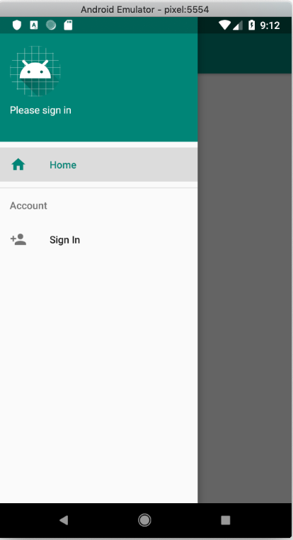

<!-- markdownlint-disable MD002 MD041 -->

[android studio] を開き、[ようこそ] 画面で [**新しい android studio プロジェクトの開始**] を選択します。 [**新しいプロジェクトの作成**] ダイアログで、[**空のアクティビティ**] を選択し、[**次へ**] を選択します。

![Android Studio の [新しいプロジェクトの作成] ダイアログのスクリーンショット](./images/choose-project.png)

[**プロジェクトの構成**] ダイアログで、[**名前**] `Graph Tutorial`をに設定し、[ **Language** ] `Java`フィールドがに設定されていることを`API 27: Android 8.1 (Oreo)`確認して、[**最小 API レベル**] がに設定されていることを確認します。 必要に応じて、**パッケージ名**と**保存場所**を変更します。 **[完了]** を選択します。

![[プロジェクトの構成] ダイアログのスクリーンショット](./images/configure-project.png)

> [!IMPORTANT]
> これらのラボ手順で指定したプロジェクトの名前と完全に同じ名前を入力してください。 プロジェクト名は、コード内の名前空間の一部になります。 これらの手順内のコードは、この手順で指定したプロジェクト名に一致する名前空間に依存します。 別のプロジェクト名を使用すると、プロジェクトの作成時に入力したプロジェクト名に一致するすべての名前空間を調整しない限り、コードはコンパイルされません。

に進む前に、後で使用する追加の依存関係をインストールします。

- `com.android.support:design`を選択して、ナビゲーションドロアーレイアウトをアプリで使用できるようにします。
- Azure AD 認証とトークン管理を処理するため[の、Android 用 Microsoft Authentication Library (msal)](https://github.com/AzureAD/microsoft-authentication-library-for-android) 。
- microsoft graph [SDK for Java](https://github.com/microsoftgraph/msgraph-sdk-java)を使用して microsoft graph を呼び出すことができます。

[ **Gradle Scripts**] を展開し、 **Gradle (Module: app)** ファイルを開きます。 値の`dependencies`中に次の行を追加します。

```Gradle
implementation 'com.android.support:design:28.0.0'
implementation 'com.microsoft.graph:microsoft-graph:1.1.+'
implementation 'com.microsoft.identity.client:msal:0.2.+'
```

> [!NOTE]
> 別のバージョンの SDK を使用している場合は、を`28.0.0`変更して、gradle に`com.android.support:appcompat-v7`既に存在する**** 依存関係のバージョンと一致するようにしてください。

`packagingOptions` **gradle (Module: app)** ファイル内の値の`android`内部を追加します。

```Gradle
packagingOptions {
    pickFirst 'META-INF/jersey-module-version'
}
```

変更を保存します。 [**ファイル**] メニューの [**プロジェクトを Gradle ファイルと同期**] を選択します。

## <a name="design-the-app"></a>アプリを設計する

アプリケーションは、[ナビゲーションドロアー](https://developer.android.com/training/implementing-navigation/nav-drawer)を使用して、さまざまなビュー間を移動します。 この手順では、ナビゲーションドロアーレイアウトを使用するようにアクティビティを更新し、ビューのフラグメントを追加します。

### <a name="create-a-navigation-drawer"></a>ナビゲーションドロアーを作成する

最初に、アプリのナビゲーションメニューのアイコンを作成します。 **app/res/** 作成用フォルダーを右クリックし、[**新規**]、[**ベクトルアセット**] の順に選択します。 [**クリップアート**] の横にあるアイコンボタンをクリックします。 **[アイコンの選択**] ウィンドウで`home` 、検索バーに入力し、[**ホーム**] アイコンを選択して、[ **OK]** を選択します。 **名前**をに`ic_menu_home`変更します。

![[ベクトルアセットの構成] ウィンドウのスクリーンショット](./images/create-icon.png)

[**次へ**] を選択し、[**完了**] をクリックします。 この手順を繰り返して、さらに2つのアイコンを作成します。

- 名前: `ic_menu_calendar`、アイコン:`event`
- 名前: `ic_menu_signout`、アイコン:`exit to app`
- 名前: `ic_menu_signin`、アイコン:`person add`

次に、アプリケーションのメニューを作成します。 **res**フォルダーを右クリックし、[**新規作成**]、[ **Android リソースディレクトリ**] の順に選択します。 リソースの**種類**をに`menu`変更し、[ **OK]** を選択します。

新しい**メニュー**フォルダーを右クリックし、[**新規作成**]、[**メニューのリソースファイル]** の順に選択します。 ファイル`drawer_menu`に名前を指定して、[ **OK]** を選択します。 ファイルが開いたら、[**テキスト**] タブを選択して XML を表示し、コンテンツ全体を次のように置き換えます。

```xml
<?xml version="1.0" encoding="utf-8"?>
<menu xmlns:android="http://schemas.android.com/apk/res/android"
    xmlns:tools="http://schemas.android.com/tools"
    tools:showIn="navigation_view">

    <group android:checkableBehavior="single">
        <item
            android:id="@+id/nav_home"
            android:icon="@drawable/ic_menu_home"
            android:title="Home" />

        <item
            android:id="@+id/nav_calendar"
            android:icon="@drawable/ic_menu_calendar"
            android:title="Calendar" />
    </group>

    <item android:title="Account">
        <menu>
            <item
                android:id="@+id/nav_signin"
                android:icon="@drawable/ic_menu_signin"
                android:title="Sign In" />

            <item
                android:id="@+id/nav_signout"
                android:icon="@drawable/ic_menu_signout"
                android:title="Sign Out" />
        </menu>
    </item>

</menu>
```

次に、ナビゲーションドロアーと互換性を持つようにアプリケーションのテーマを更新します。 **app/res/values/styles xml**ファイルを開きます。 を`Theme.AppCompat.Light.DarkActionBar`に`Theme.AppCompat.Light.NoActionBar`置き換えます。 その後、要素内に`style`次の行を追加します。

```xml
<item name="windowActionBar">false</item>
<item name="windowNoTitle">true</item>
<item name="android:statusBarColor">@android:color/transparent</item>
```

次に、メニューのヘッダーを作成します。 **app/res/layout**フォルダーを右クリックします。 [**新規**] を選択し、[**リソースファイルのレイアウト**] を選択します。 ファイル`nav_header`に名前を指定し、**ルート要素**をに`LinearLayout`変更します。 **[OK]** をクリックします。

**nav_header**ファイルを開き、[**テキスト**] タブを選択します。内容全体を次のように置き換えます。

```xml
<?xml version="1.0" encoding="utf-8"?>
<<?xml version="1.0" encoding="utf-8"?>
<LinearLayout xmlns:android="http://schemas.android.com/apk/res/android"
    android:layout_width="match_parent"
    android:layout_height="176dp"
    android:background="@color/colorPrimary"
    android:gravity="bottom"
    android:orientation="vertical"
    android:padding="16dp"
    android:theme="@style/ThemeOverlay.AppCompat.Dark">

    <ImageView
        android:id="@+id/user_profile_pic"
        android:layout_width="wrap_content"
        android:layout_height="wrap_content"
        android:src="@mipmap/ic_launcher" />

    <TextView
        android:id="@+id/user_name"
        android:layout_width="wrap_content"
        android:layout_height="wrap_content"
        android:paddingTop="8dp"
        android:text="Test User"
        android:textAppearance="@style/TextAppearance.AppCompat.Body1" />

    <TextView
        android:id="@+id/user_email"
        android:layout_width="wrap_content"
        android:layout_height="wrap_content"
        android:text="test@contoso.com" />

</LinearLayout>
```

ここで、 **app/res/layout/activity_main**ファイルを開きます。 既存の XML を次`DrawerLayout`のように置き換えて、レイアウトをに更新します。

```xml
<?xml version="1.0" encoding="utf-8"?>
<android.support.v4.widget.DrawerLayout xmlns:android="http://schemas.android.com/apk/res/android"
    xmlns:app="http://schemas.android.com/apk/res-auto"
    xmlns:tools="http://schemas.android.com/tools"
    android:id="@+id/drawer_layout"
    android:layout_width="match_parent"
    android:layout_height="match_parent"
    android:fitsSystemWindows="true"
    tools:context=".MainActivity"
    tools:openDrawer="start">

    <RelativeLayout
        android:layout_width="match_parent"
        android:layout_height="match_parent"
        android:orientation="vertical">

        <ProgressBar
            android:id="@+id/progressbar"
            android:layout_width="75dp"
            android:layout_height="75dp"
            android:layout_centerInParent="true"
            android:visibility="gone"/>

        <android.support.v7.widget.Toolbar
            android:id="@+id/toolbar"
            android:layout_width="match_parent"
            android:layout_height="?attr/actionBarSize"
            android:background="@color/colorPrimary"
            android:elevation="4dp"
            android:theme="@style/ThemeOverlay.AppCompat.Dark.ActionBar" />

        <FrameLayout
            android:id="@+id/fragment_container"
            android:layout_width="match_parent"
            android:layout_height="match_parent"
            android:layout_below="@+id/toolbar" />
    </RelativeLayout>

    <android.support.design.widget.NavigationView
        android:id="@+id/nav_view"
        android:layout_width="wrap_content"
        android:layout_height="match_parent"
        android:layout_gravity="start"
        app:headerLayout="@layout/nav_header"
        app:menu="@menu/drawer_menu" />

</android.support.v4.widget.DrawerLayout>
```

次に、 **app/res/values/strings/xml**を開きます。 要素内に`resources`次の要素を追加します。

```xml
<string name="navigation_drawer_open">Open navigation drawer</string>
<string name="navigation_drawer_close">Close navigation drawer</string>
```

最後に、 **app/java/com/example/graphtutorial/mainactivity**ファイルを開きます。 内容全体を次のように置き換えます。

```java
package com.example.graphtutorial;

import android.support.annotation.NonNull;
import android.support.design.widget.NavigationView;
import android.support.v4.view.GravityCompat;
import android.support.v4.widget.DrawerLayout;
import android.support.v7.app.ActionBarDrawerToggle;
import android.support.v7.app.AppCompatActivity;
import android.os.Bundle;
import android.support.v7.widget.Toolbar;
import android.view.Menu;
import android.view.MenuItem;
import android.view.View;
import android.widget.TextView;

public class MainActivity extends AppCompatActivity implements NavigationView.OnNavigationItemSelectedListener {
    private DrawerLayout mDrawer;
    private NavigationView mNavigationView;
    private View mHeaderView;
    private boolean mIsSignedIn = false;
    private String mUserName = null;
    private String mUserEmail = null;

    @Override
    protected void onCreate(Bundle savedInstanceState) {
        super.onCreate(savedInstanceState);
        setContentView(R.layout.activity_main);

        // Set the toolbar
        Toolbar toolbar = findViewById(R.id.toolbar);
        setSupportActionBar(toolbar);

        mDrawer = findViewById(R.id.drawer_layout);

        // Add the hamburger menu icon
        ActionBarDrawerToggle toggle = new ActionBarDrawerToggle(this, mDrawer, toolbar,
                R.string.navigation_drawer_open, R.string.navigation_drawer_close);
        mDrawer.addDrawerListener(toggle);
        toggle.syncState();

        mNavigationView = findViewById(R.id.nav_view);

        // Set user name and email
        mHeaderView = mNavigationView.getHeaderView(0);
        setSignedInState(mIsSignedIn);

        // Listen for item select events on menu
        mNavigationView.setNavigationItemSelectedListener(this);
    }

    @Override
    public boolean onNavigationItemSelected(@NonNull MenuItem menuItem) {
        // TEMPORARY
        return false;
    }

    @Override
    public void onBackPressed() {
        if (mDrawer.isDrawerOpen(GravityCompat.START)) {
            mDrawer.closeDrawer(GravityCompat.START);
        } else {
            super.onBackPressed();
        }
    }

    public void showProgressBar()
    {
        FrameLayout container = findViewById(R.id.fragment_container);
        ProgressBar progressBar = findViewById(R.id.progressbar);
        container.setVisibility(View.GONE);
        progressBar.setVisibility(View.VISIBLE);
    }

    public void hideProgressBar()
    {
        FrameLayout container = findViewById(R.id.fragment_container);
        ProgressBar progressBar = findViewById(R.id.progressbar);
        progressBar.setVisibility(View.GONE);
        container.setVisibility(View.VISIBLE);
    }

    // Update the menu and get the user's name and email
    private void setSignedInState(boolean isSignedIn) {
        mIsSignedIn = isSignedIn;

        Menu menu = mNavigationView.getMenu();

        // Hide/show the Sign in, Calendar, and Sign Out buttons
        menu.findItem(R.id.nav_signin).setVisible(!isSignedIn);
        menu.findItem(R.id.nav_calendar).setVisible(isSignedIn);
        menu.findItem(R.id.nav_signout).setVisible(isSignedIn);

        // Set the user name and email in the nav drawer
        TextView userName = mHeaderView.findViewById(R.id.user_name);
        TextView userEmail = mHeaderView.findViewById(R.id.user_email);

        if (isSignedIn) {
            // For testing
            mUserName = "Megan Bowen";
            mUserEmail = "meganb@contoso.com";

            userName.setText(mUserName);
            userEmail.setText(mUserEmail);
        } else {
            mUserName = null;
            mUserEmail = null;

            userName.setText("Please sign in");
            userEmail.setText("");
        }
    }
}
```

### <a name="add-fragments"></a>フラグメントを追加する

**app/res/layout**フォルダーを右クリックし、[**新規作成**]、[**リソースファイルのレイアウト**] の順に選択します。 ファイル`fragment_home`に名前を指定し、**ルート要素**をに`RelativeLayout`変更します。 **[OK]** をクリックします。

**fragment_home**ファイルを開き、その内容を次のように置き換えます。

```xml
<?xml version="1.0" encoding="utf-8"?>
<RelativeLayout xmlns:android="http://schemas.android.com/apk/res/android"
    android:layout_width="match_parent"
    android:layout_height="match_parent">

    <LinearLayout
        android:layout_width="wrap_content"
        android:layout_height="wrap_content"
        android:layout_centerInParent="true"
        android:orientation="vertical">

        <TextView
            android:layout_width="wrap_content"
            android:layout_height="wrap_content"
            android:layout_gravity="center_horizontal"
            android:text="Welcome!"
            android:textSize="30sp" />

        <TextView
            android:id="@+id/home_page_username"
            android:layout_width="wrap_content"
            android:layout_height="wrap_content"
            android:layout_gravity="center_horizontal"
            android:paddingTop="8dp"
            android:text="Please sign in"
            android:textSize="20sp" />
    </LinearLayout>

</RelativeLayout>
```

次に、 **app/res/layout**フォルダーを右クリックし、[**新規作成**]、[**リソースファイルのレイアウト**] の順に選択します。 ファイル`fragment_calendar`に名前を指定し、**ルート要素**をに`RelativeLayout`変更します。 **[OK]** をクリックします。

**fragment_calendar**ファイルを開き、その内容を次のように置き換えます。

```xml
<?xml version="1.0" encoding="utf-8"?>
<RelativeLayout xmlns:android="http://schemas.android.com/apk/res/android"
    android:layout_width="match_parent"
    android:layout_height="match_parent">

    <TextView
        android:layout_width="wrap_content"
        android:layout_height="wrap_content"
        android:layout_centerInParent="true"
        android:text="Calendar"
        android:textSize="30sp" />

</RelativeLayout>
```

次に、[ **app/java/com. 例**] というチュートリアルフォルダーを右クリックし、[**新規**]、[ **java クラス**] の順に選択します。 クラス`HomeFragment`に名前を指定し、**スーパー**クラスをに`android.support.v4.app.Fragment`設定します。 **[OK]** をクリックします。 [**ホーム] フラグメント**ファイルを開き、そのコンテンツを次のように置き換えます。

```java
package com.example.graphtutorial;

import android.os.Bundle;
import android.support.annotation.NonNull;
import android.support.annotation.Nullable;
import android.support.v4.app.Fragment;
import android.view.LayoutInflater;
import android.view.View;
import android.view.ViewGroup;
import android.widget.TextView;

public class HomeFragment extends Fragment {
    private static final String USER_NAME = "userName";

    private String mUserName;

    public HomeFragment() {

    }

    public static HomeFragment createInstance(String userName) {
        HomeFragment fragment = new HomeFragment();

        // Add the provided username to the fragment's arguments
        Bundle args = new Bundle();
        args.putString(USER_NAME, userName);
        fragment.setArguments(args);
        return fragment;
    }

    @Override
    public void onCreate(@Nullable Bundle savedInstanceState) {
        super.onCreate(savedInstanceState);
        if (getArguments() != null) {
            mUserName = getArguments().getString(USER_NAME);
        }
    }

    @Nullable
    @Override
    public View onCreateView(@NonNull LayoutInflater inflater, @Nullable ViewGroup container, @Nullable Bundle savedInstanceState) {
        View homeView = inflater.inflate(R.layout.fragment_home, container, false);

        // If there is a username, replace the "Please sign in" with the username
        if (mUserName != null) {
            TextView userName = homeView.findViewById(R.id.home_page_username);
            userName.setText(mUserName);
        }

        return homeView;
    }
}
```

次に、[ **app/java/com. 例**] を右クリックし、[**新規作成**]、[ **java クラス**] の順に選択します。 クラス`CalendarFragment`に名前を指定し、**スーパー**クラスをに`android.support.v4.app.Fragment`設定します。 **[OK]** をクリックします。

**calendarfragment**ファイルを開き、次の関数を`CalendarFragment`クラスに追加します。

```java
@Nullable
@Override
public View onCreateView(@NonNull LayoutInflater inflater, @Nullable ViewGroup container, @Nullable Bundle savedInstanceState) {
    return inflater.inflate(R.layout.fragment_calendar, container, false);
}
```

フラグメントが実装されたので、 `MainActivity` `onNavigationItemSelected`イベントを処理するようにクラスを更新し、フラグメントを使用します。 最初に、次の関数をクラスに追加します。

```java
// Load the "Home" fragment
public void openHomeFragment(String userName) {
    HomeFragment fragment = HomeFragment.createInstance(userName);
    getSupportFragmentManager().beginTransaction()
            .replace(R.id.fragment_container, fragment)
            .commit();
    mNavigationView.setCheckedItem(R.id.nav_home);
}

// Load the "Calendar" fragment
private void openCalendarFragment() {
    getSupportFragmentManager().beginTransaction()
            .replace(R.id.fragment_container, new CalendarFragment())
            .commit();
    mNavigationView.setCheckedItem(R.id.nav_calendar);
}

private void signIn() {
    setSignedInState(true);
    openHomeFragment(mUserName);
}

private void signOut() {
    setSignedInState(false);
    openHomeFragment(mUserName);
}
```

次に、既存`onNavigationItemSelected`の関数を次のように置き換えます。

```java
@Override
public boolean onNavigationItemSelected(@NonNull MenuItem menuItem) {
    // Load the fragment that corresponds to the selected item
    switch (menuItem.getItemId()) {
        case R.id.nav_home:
            openHomeFragment(mUserName);
            break;
        case R.id.nav_calendar:
            openCalendarFragment();
            break;
        case R.id.nav_signin:
            signIn();
            break;
        case R.id.nav_signout:
            signOut();
            break;
    }

    mDrawer.closeDrawer(GravityCompat.START);

    return true;
}
```

最後に、次のように`onCreate`関数の末尾にを追加して、アプリの起動時にホームフラグメントを読み込みます。

```java
// Load the home fragment by default on startup
if (savedInstanceState == null) {
    openHomeFragment(mUserName);
}
```

すべての変更を保存します。 [**実行**] メニューの [ **' app ' の実行**] を選択します。 アプリのメニューは、2つのフラグメント間を移動し、[**サインイン**] または [**サインアウト**] ボタンをタップすると、変更されます。

